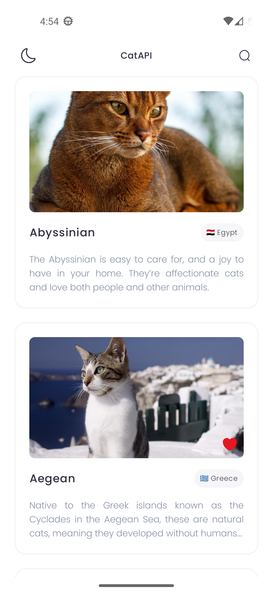
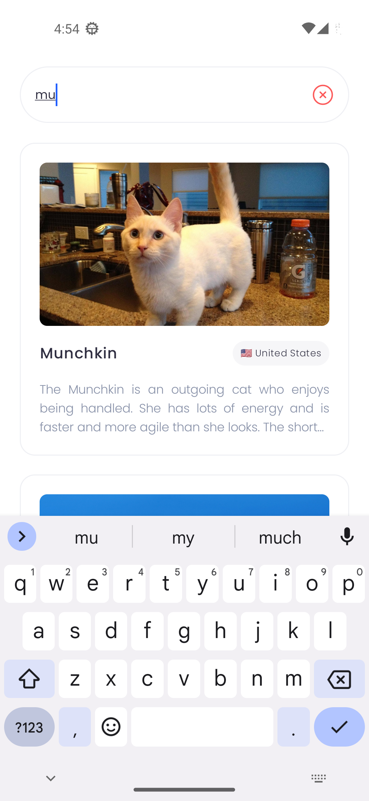
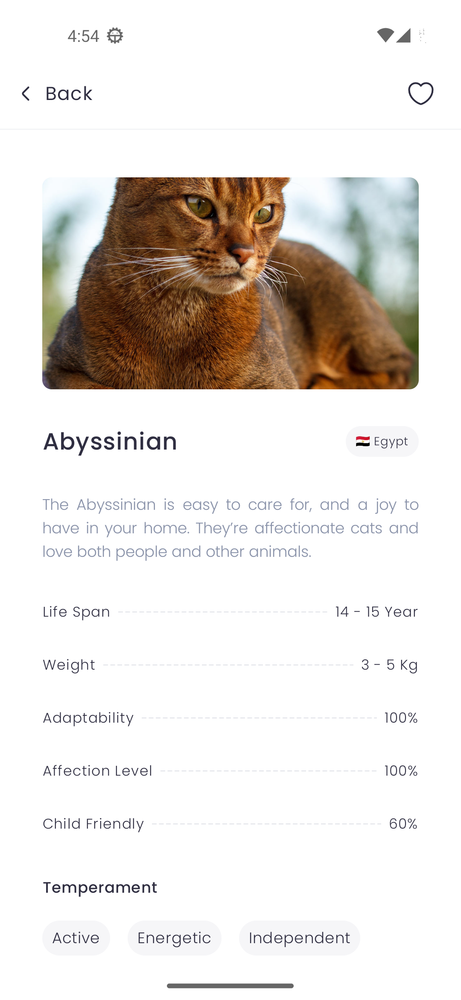
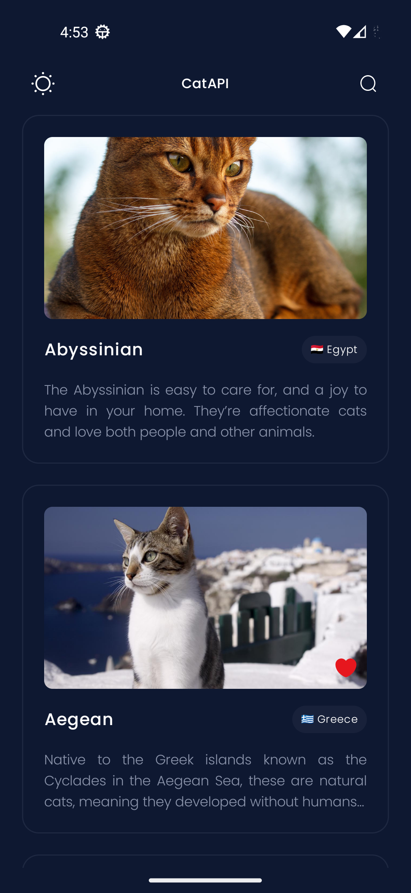
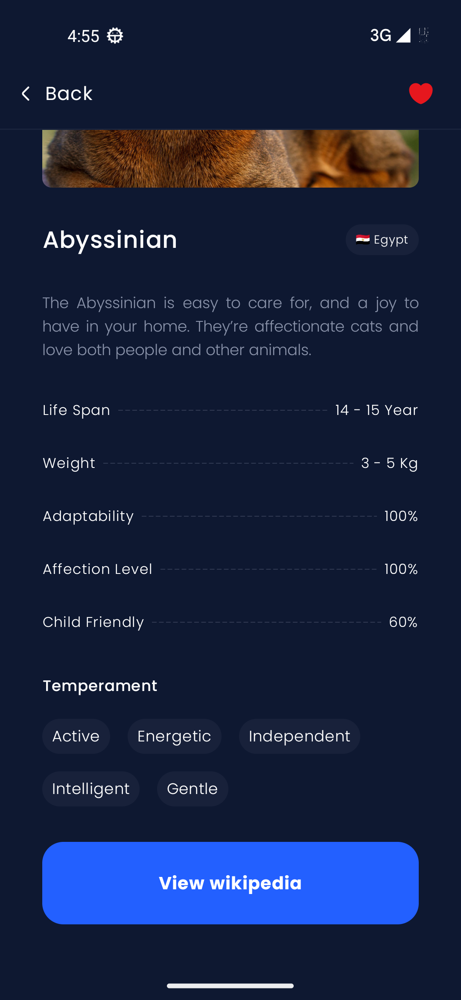

# Cat Breeds Android Application

This is an Android application that interacts with [The Cat API](https://thecatapi.com/) to display cat breeds, their details, and images. The app is designed with modern Android development tools and follows best practices for architecture, offline-first behavior, jetpack-compose, and dependency injection.

## Contact Information
- Developer: Mohamad Hoseini
- Email: Mhoseini967@gmail.com


## ScreenShots









## Table of Contents
- [Technologies](#technologies)
- [Features](#features)
- [Architecture](#architecture)
- [Setup Instructions](#setup-instructions)
- [Libraries](#libraries)
- [Offline Support](#offline-support)
- [API Key Configuration](#api-key-configuration)
- [Screenshots](#screenshots)
- [Testing](#testing)
- [Contributing](#contributing)

## Technologies

- **Kotlin**: The app is written in Kotlin, leveraging the latest features of the language.
- **Jetpack Compose**: The UI is built using Jetpack Compose, following Material 3 guidelines.
- **MVI (Model-View-Intent) Architecture**: Clean architecture with separate layers for presentation, domain, and data.
- **Hilt**: Used for dependency injection to ensure proper scoping and modularity.
- **Room**: Local database for offline caching and persisting user data, such as favorites.
- **Retrofit & OkHttp**: For networking and API calls to The Cat API.
- **Flow and Coroutines**: Used for asynchronous operations and reactive data handling.

## Features

- **Cat List Screen**:
    - Displays a paginated list of cat breeds.
    - Each breed has its name, a high-quality image, and additional details like description  and origin.
    - Real-time search with debounced input to filter cat breeds by name.
    - Pull-to-refresh functionality to reload the cat breeds list.
    - Error handling for network issues, rate limits, and malformed API responses.

- **Cat Detail Screen**:
    - Displays detailed information about a selected cat breed, including description, temperament, origin, lifespan, and more.
    - A button to open the breed’s Wikipedia page in a browser or WebView.
    - Offline caching of details for viewing without internet.

- **Favorites**:
    - Mark breeds as favorites and persist the favorites across app restarts in room database.
    - Display favorited breeds distinctly in the breed list.

- **Offline-First**:
    - Data is cached locally using Room and displayed even when offline. The app is designed to work seamlessly without an internet connection, syncing with the online data when available.

- **Dynamic Theme Switching**:
    - Light and dark themes supported with persistence across app restarts.

## Architecture

The app follows a **Clean Architecture** pattern with the following layers:

1. **Presentation Layer (UI)**: Handles user interactions through Jetpack Compose.
2. **Domain Layer**: Contains use cases that handle business logic and interact with repositories.
3. **Data Layer**: Manages data sources (network and database), implements repositories, and maps the API response to domain models.
4. **Networking**: Retrofit is used for API calls, with OkHttp as the HTTP client. A custom interceptor is used for managing the API key securely.
5. **Offline-First**: All data is cached locally using Room (SSOT), and the app supports offline functionality.

The app also implements **MVI (Model-View-Intent)** architecture to separate concerns between UI, business logic, and data management.

## Setup Instructions

1. **Clone the Repository**:
   ```bash
   git clone https://github.com/mhoseini967/CatAPI.git
   cd cat-breeds-app

2. **Add your API Key**:
local.properties
   ```bash
   API_KEY=your_api_key_here


